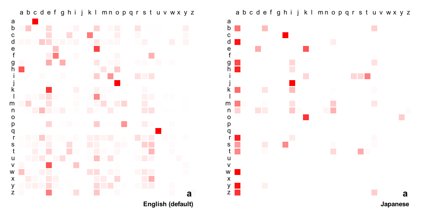

# Rangen: Name

Rangen is a suite of random generators and procedural generation tools; rangen-name focuses on name generation.

## TL;DR

The lib provides you with 3 core functions:

- the `generateFirstname()`: gets a random item from lists of common male or female firstnames
- the `generateLastname()`: uses a 3-step Markov Chain process to create a random (but plausible) surname
- the `generateFullName()`: combines a firstname and lastname (with the previous rules) to get a full name

And an additional function, `exportProbabilityMatrix()`, to visualise the 3-D probability matrix that is used by the lastame generator (see below for more details).
### Installing via NPM

You can install it via NPM (or Yarn):

```
npm install @mpecheux/rangen-name
yarn add @mpecheux/rangen-name
```

In a Node context, you can then import the package using the `require` keyword:

```js
const rangenName = require("@mpecheux/rangen-name");

const name = rangenName.generateFullName();
console.log(name);
// Leslie Kitton
```

For ES6 JavaScript, use the `import` keyword:

```js
import rangenName from "@mpecheux/rangen-name";

const name = rangenName.generateFullName();
console.log(name);
// Vincent Bows
```

### Using CDN versions

You can also use the CDN versions directly if you don't want to install anything:

```html
<!DOCTYPE html>
<html lang="en">
<head>
  <title>Rangen: Name - Demo</title>
  <script src="https://unpkg.com/@mpecheux/rangen-name@0.1.3/dist/rangen-name.min.js"></script>
  <!-- or:
    <script src="https://cdn.jsdelivr.net/npm/@mpecheux/rangen-name@0.1.3/dist/rangen-name.min.js"></script>
  -->
</head>
<body>
  <div id="message"></div>
  <button onclick="generateName()">Generate!</button>
  <script>
    const generateName = () => {
      const name = RangenName.generateFullName();
      document.getElementById("message").innerText = name;
    }

    window.onload = () => {
      generateName();
    }
  </script>
</body>
</html>
```

(Or download them and put them in your project as local dependencies ;) )

## Using custom reference lists

### For firstnames

The firstname generator in this package simply picks one firstname at random in given lists of male/female firstnames, depending on the gender of the name you asked for (or with a 50/50% chance of male/female name if you didn't specify anything).

The generator is loaded up with a list of common firstnames but, if you want, you can also configure the generator with your own lists:

```js
const rangenName = require("@mpecheux/rangen-name");

for (let i = 0; i < 7; i++)
  console.log(rangenName.generateFirstname({
    maleFirstnameReferenceList: ["Bob", "John", "Mike"],
    femaleFirstnameReferenceList: ["Elise", "Anna", "Tanya"]
  }));
// Bob
// Anna
// John
```

### For lastnames

The lastname generator, on the other hand, relies on [Markov chains](https://en.wikipedia.org/wiki/Markov_chain); the chain transition probabilities are initialised based on a reference list of common surnames (for more info, check [the Medium article](https://medium.com/codex/generating-random-names-using-maths-8872a8f3b981) I wrote about this lib), and so this reference list is essential in defining the **possible letter sequences** for the generator.

By default, the generator uses a list of *English* lastnames scraped from the Internet.

But you can, of course, pass in your own reference list if you want! This will allow you to generate names that are completely different and "resemble" your custom reference :)

To do that, just use the `lastnameReferenceList` option:

```js
const rangenName = require("@mpecheux/rangen-name");

for (let i = 0; i < 7; i++)
  console.log(rangenName.generateLastname({
    lastnameReferenceList: ["Momomomo", "Titititi", "Yuyuyu", "Lalala", "Lololo"]
  }));
// Titi
// Titi
// Yuyu
// Yuyu
// Momomo
// Lolo
// Momo
```

Remember: the longer your list, the better it is for the generator because it will have more "raw data" to learn from! In my example, there are too few reference strings to make a credible generator.

On the other hand, here are some results if I feed a list of common Greek surnames:

```js
const rangenName = require("@mpecheux/rangen-name");

const greekSurnames = require("/path/to/data/greek-surnames.json");
for (let i = 0; i < 3; i++)
  console.log(rangenName.generateLastname({
    lastnameReferenceList: greekSurnames
  }));
// Kambros
// Balla
// Poulos
```

Or of Japanese lastnames:

```js
const rangenName = require("@mpecheux/rangen-name");

const japaneseSurnames = require("/path/to/data/japanese-surnames.json");
for (let i = 0; i < 3; i++)
  console.log(rangenName.generateLastname({
    lastnameReferenceList: japaneseSurnames
  }));
// Higuchi
// Hata
// Mura
```

### For full names

The firstnames aren't auto-correlated, but you can naturally combine the two features and pass all the options to the `generateFullName()` function to better "control the randomness" and get more relevant results:

```js
const rangenName = require("@mpecheux/rangen-name");

const japaneseSurnames = require("/path/to/data/japanese-surnames.json");
for (let i = 0; i < 3; i++)
  console.log(rangenName.generateFullName({
    maleFirstnameReferenceList: ["Akira", "Banzan", "Daido", "Haru", "Ichiro", "Itsu", "Jiro", "Kazuo"],
    femaleFirstnameReferenceList: ["Eido", "Hama", "Hanako", "Iva", "Jin", "Kane", "Kaori", "Kaya"],
    lastnameReferenceList: greekSurnames
  }));
// Itsu Oyazawa
// Jin Mori
// Eido Kanamoto
```

## Visualising the probability matrix

If you want to understand how the Markov chain of your generator is currently configured, you can export the 3-D matrix as a series of PNG images and visualise the probable letter sequences.

We need to visualise a 3-dimensional object, but it is more readable as "slices": foreach symbol in the alphabet, we show the corresponding 2D sub-probability matrix (i.e. the 2-letters sequence probability if the current character is the one we chose).

Each image is a 2D heatmap grid that shows with white-to-red cells the probability each transition has of occurring:


- in the bottom-right corner, you see the current "slice", i.e. the current character `c1` you're at in your generated name
- then, the rows list the possibilities for the next character `c2`
- and for each row, the color of the cell at a given column `c3` corresponds to the probability of having the `c1-c2-c3` sequence in your word
  
For example, here, we have the heatmap for `c1` = "a". We see that:
- if `c1` = "a" and `c2` = "a" also, then we're forced to have `c3` = "c": in our reference list, only the sequence "aac" exists
- but if `c2` = "d", we have lots of different possibilities that are each about as probable: "add", "ade"...
- we apparently have never encountered a sequence with "ao" in this reference list: there is no possible transition after that!

What's really interesting is to compare the probability matrix for two different reference lists. For example, here, I compare the "a" slice of my 3-D probability matrix for the default reference list of English surnames, and for my reference list of Japanese surnames:



We clearly see that, even though we're using the same letters, the letter sequences are completely different! Meaning that, in turn, the generated names will be widely different too :)

(For example, the sequence "aka" is quite common in Japanese and non-existent in English, while "aha" are quite common in both reference lists!)

## API

### Util constants

The lib has a list of useful constants you can use in the 3 core functions:

- `UNDEFINED`: "undefined" (50/50% chance of having a female/male name)
- `MALE`: "male"
- `FEMALE`: "female"
- `CASING_LOWERCASE`: "lowercase"
- `CASING_TITLE`: "title"
- `CASING_UPPERCASE`: "uppercase"

### `generateFirstname()`

Parameters:

- `sex`: determines if you want a male or a female firstname; can be "undefined", "male" or "female"
  
  [default: CONSTANTS.UNDEFINED]
- `casing`: applies a specific casing to the generated value; can be "lowercase", "title" and "uppercase"
  
  [default: CONSTANTS.CASING_TITLE]

- `maleFirstnameReferenceList`: custom list of strings to pick male firstnames from
  
  [default: `null`]

- `femaleFirstnameReferenceList`: custom list of strings to pick female firstnames from
  
  [default: `null`]

```js
const firstname = rangenName.generateFirstname({
  sex: rangenName.CONSTANTS.FEMALE,
  casing: rangenName.CONSTANTS.CASING_UPPERCASE
});
console.log(firstname);
// LORIANNE
```

## `generateLastname()`

Parameters:

- `maxLen`: maximum length for the generated surname
  
  [default: 10]
- `stopThreshold`: probability of stopping when the generated surname contains a known word-end
  
  [default: 0.75]
- `casing`: applies a specific casing to the generated value; can be "lowercase", "title" and "uppercase"
  
  [default: CONSTANTS.CASING_TITLE]

- `lastnameReferenceList`: custom list of strings to use as reference for the probable letter sequences in the generator
  
  [default: `null`]

```js
const lastname = rangenName.generateLastname({
  maxLen: 15,
  stopThreshold: 0.35,
  casing: rangenName.CONSTANTS.CASING_LOWERCASE
});
console.log(lastname);
// holdrey
```

## `generateFullName()`

Parameters:

- `sex`: determines if you want a male or a female firstname; can be "undefined", "male" or "female"
  
  [default: CONSTANTS.UNDEFINED]
- `maxLen`: maximum length for the generated surname
  
  [default: 10]
- `stopThreshold`: probability of stopping when the generated surname contains a known word-end
  
  [default: 0.75]
- `casing`: applies a specific casing to the generated value; can be "lowercase", "title" and "uppercase"
  
  [default: CONSTANTS.CASING_TITLE]

- `maleFirstnameReferenceList`: custom list of strings to pick male firstnames from
  
  [default: `null`]

- `femaleFirstnameReferenceList`: custom list of strings to pick female firstnames from
  
  [default: `null`]

- `lastnameReferenceList`: custom list of strings to use as reference for the probable letter sequences in the generator
  
  [default: `null`]
```js
const fullname = rangenName.generateFullName({
  sex: rangenName.CONSTANTS.MALE,
  maxLen: 15,
  stopThreshold: 0.5,
  casing: rangenName.CONSTANTS.CASING_TITLE
});
console.log(fullname);
// Tucker Ward
```

## `exportProbabilityMatrix()`

Parameters:

- `folderPath`: path to the directory to save the PNG images into
  
  [default: "./probability-matrix"]
- `onlyLetters`: whether to only show the probabilities for the common 26 letters of the alphabet, or to also include all the special symbols (`ï`, `â`, `-`, `.`...)
  
  [default: `true`]
- `generatorName`: specific name of the generator to print in the bottom-right corner of the images
  
  [default: `null`]

```js
// generate at least one lastname to
// initialize the matrix probability in the lib
const _ = rangenName.generateLastname();
rangenName.exportProbabilityMatrix({
  folderPath: "my-matrix",
  onlyLetters: true,
  generatorName: "My generator!"
});
```
